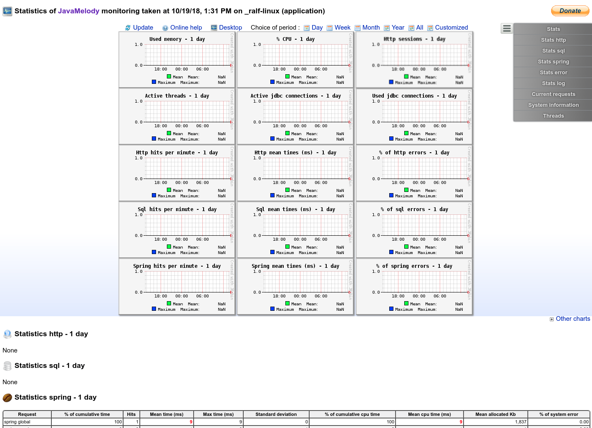

# Monitoring

By already having configured actuator we have several endpoints for monitoring the webapp.

## Prometheus

Additional monitoring can be done by using e.g. [Prometheus](https://prometheus.io/).
See <https://dzone.com/articles/monitoring-using-spring-boot-2-prometheus-and-graf>

There are already two Spring Boot packages that simply can be added as Maven dependencies:

In `pom.xml`:

```xml
<dependency>
  <groupId>io.micrometer</groupId>
  <artifactId>micrometer-core</artifactId>
</dependency>
<dependency>
  <groupId>io.micrometer</groupId>
  <artifactId>micrometer-registry-prometheus</artifactId>
</dependency>
```

After adding this, an additional `actuator-endpoint` is available under `/monitoring/prometheus`:

```sh
[2018-09-27 14:05:36,645  INFO] web.servlet.WebMvcEndpointHandlerMapping: 549 [main] - Mapped "{[/monitoring/prometheus],methods=[GET],produces=[text/plain;version=0.0.4;charset=utf-8]}" onto public java.lang.Object org.springframework.boot.actuate.endpoint.web.servlet.AbstractWebMvcEndpointHandlerMapping$OperationHandler.handle(javax.servlet.http.HttpServletRequest,java.util.Map<java.lang.String, java.lang.String>)
```

The endpoint is enabled by default, see common application properties default values:

```ini
...
# METRICS ENDPOINT (MetricsEndpoint)
management.endpoint.metrics.cache.time-to-live=0ms # Maximum time that a response can be cached.
management.endpoint.metrics.enabled=true # Whether to enable the metrics endpoint.

# PROMETHEUS ENDPOINT (PrometheusScrapeEndpoint)
management.endpoint.prometheus.cache.time-to-live=0ms # Maximum time that a response can be cached.
management.endpoint.prometheus.enabled=true # Whether to enable the prometheus endpoint.
...
```

Let's see what this endpoint responds:

```sh
$ curl -u admin:secret http://localhost:9001/monitoring/prometheus
# HELP tomcat_global_received_bytes_total  
# TYPE tomcat_global_received_bytes_total counter
tomcat_global_received_bytes_total{name="http-nio-9000",} 0.0
# HELP process_files_max The maximum file descriptor count
# TYPE process_files_max gauge
process_files_max 1048576.0
...
```

These informations can be used e.g. by Grafana to visualize system metrics (see [Grafana support for Prometheus](https://prometheus.io/docs/visualization/grafana/)).

Further reading: <https://dzone.com/articles/monitoring-using-spring-boot-20-prometheus-and-gra>

## Javamelody

Homepage: <https://github.com/javamelody/javamelody/wiki>

"The goal of JavaMelody is to monitor Java or Java EE applications in QA and production environments.
It is not a tool to simulate requests from users, it is a tool to measure and calculate statistics
on real operation of an application depending on the usage of the application by users."

### Add to project

There is a Spring Boot Starter that simply can be added as Maven dependency:

In `pom.xml`:

```xml
<dependency>
  <groupId>net.bull.javamelody</groupId>
  <artifactId>javamelody-spring-boot-starter</artifactId>
  <version>1.74.0</version>
</dependency>
```

### Configuration

We want:

- the Javamelody endpoint to reside under `/monitoring/javamelody`
- access should be controlled
  - by username `admin` and password `somepassword`.
  - by allowed IPs
- some URLs ("/webjars", "/jsondoc", "/monitoring") should be ignored for statistics
- aggregation of URLs that just differs in dynamic parts (params)

Javamelody provides configuration properties for this.

In `src/main/resources/application.yml`:

```yml
javamelody:
  enabled: true
  init-parameters:
    allowed-addr-pattern: 'localhost|127\.0\.0\.1|0:0:0:0:0:0:0:1'
    authorized-users: 'admin:somepassword'
    http-transform-pattern: '(\\d+|(?<=currenttitles/).*|(?<=citationtitles/).*|(?<=occurrences/).*|(?<=periodical/).*|(?<=issues/).*)'
    # log http requests:
    log: false
    monitoring-path: '/monitoring/javamelody'
    url-exclude-pattern: '^(/webjars|/jsondoc|/monitoring).*'
```

"The parameter http-transform-pattern is a regular expression to transform descriptions of http requests and to delete dynamic parts (identifiers of objects for example), in order to aggregate the statistics on these requests irrespective of dynamic parts. This parameter replaces any part of the URL that matches the regular expression with a "$". So setting http-transform-pattern to \d+ means that the URLs "/get/entity/10" and "/get/entity/20" both have their digits matched by the regular expression, and are then aggregated into the URL "/get/entity/$"."

Hint: We added IPv6 IP for localhost for local tests...

### Security

By adding `authorized-users`configuration Basic-Auth is activated. This is handled internally by Javamelody.
As this got in conflict with our Spring Security configuration (Spring Security tries to handle Basic-Auth-request as soon as it finds Basic-Auth-Header - even if URL is set to "permitAll"!),
we have to change our `SpringConfigSecurity.java` code to tell Spring Security to ignore requests to `/monitoring/javamelody`completely:

```java
public class SpringConfigSecurity extends WebSecurityConfigurerAdapter {

  @Value("${javamelody.init-parameters.monitoring-path:/monitoring}")
  String javamelodyMonitoringPath;

  ...

  @Override
  public void configure(WebSecurity web) throws Exception {
    web.ignoring().antMatchers(javamelodyMonitoringPath);
  }
}
```

### Usage

Browse <http://localhost:9000/monitoring/javamelody>:


