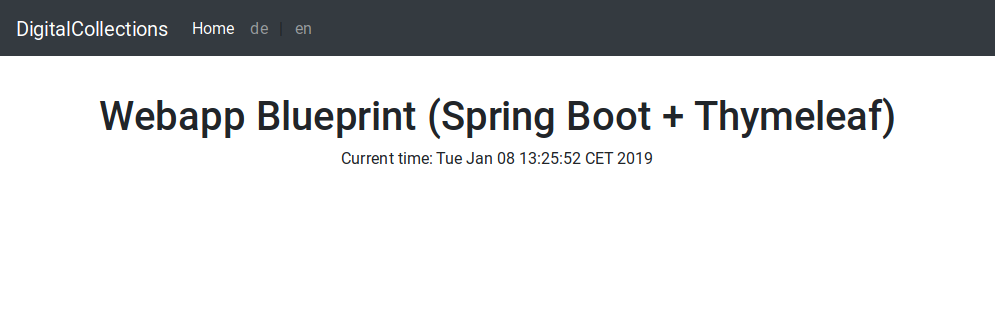

# Migration for Bootstrap 3 to 4

In this section we migrate and upgrade our Bootstrap 3 webpage to the latest Boostrap 4 version.

Unfortunately, Bootstrap 4 has a lot of breaking changes, and a good starting point for a migration guide line
is the official migration document from Bootstrap:

<https://getbootstrap.com/docs/4.0/migration/>

## Replace Bootstrap CSS file

The first step in our webpage migration is to replace the static Boostrap CSS file with the latest version of
Bootstrap. All static CSS files are located under:

`src/main/resources/static/css`.

Only the minified Bootstrap core file, `bootstrap.min.css` needs to be replaced.

This could be done with a simple `wget` or `curl` command:

```bash
$ cd src/main/resources/static/css
$ rm -f bootstrap.min.css
$ wget https://stackpath.bootstrapcdn.com/bootstrap/4.2.1/css/bootstrap.min.css
```

This replaces the old CSS file for Bootstrap 3 with the latest Bootstrap 4.2.1 version.

## Replace Bootstrap Javascript file

In the second step in our webpage migration, the old Javascript file for Bootstrap 3 needs to be replaced with
a newer one. This could be done with the following command:

```bash
$ cd src/main/resources/static/js
$ rm -f bootstrap.min.js
$ wget https://stackpath.bootstrapcdn.com/bootstrap/4.2.1/js/bootstrap.min.js
```

## Migrate static templates

In the third step of this tutorial, the static templates located under `src/main/resources/templates` needs to
be migrated to Bootstrap 4 syntax.

This step is a bit time consuming, but at the end you'll have a shiny Bootstrap 4 webpage 🤗

### Base template

The `navbar` component was heavily refactored in Bootstrap 4:

* Responsive navbar behaviors are now applied to the `.navbar` class via the required `.navbar-expand-{breakpoint}` 
  where you choose where to collapse the `navbar`. Previously this was a Less variable modification and required recompiling.
* `.navbar-default` is now `.navbar-light`, though `.navbar-dark` remains the same. 
  One of these is required on each `navbar`. However, these classes no longer set background-colors;
  instead they essentially only affect color.
* Navbars now require a background declaration of some kind. Choose from our background utilities (`.bg-*`) or set your own 
  with the light/inverse classes above for mad customization.
* Given flexbox styles, navbars can now use flexbox utilities for easy alignment options.
* `.navbar-toggle` is now `.navbar-toggler` and has different styles and inner markup (no more three `<span>`s).
* Dropped the `.navbar-form` class entirely. It’s no longer necessary; instead, just use `.form-inline` 
  and apply margin utilities as necessary.
* Navbars no longer include `margin-bottom` or `border-radius` by default. Use utilities as necessary.

Thus, the old `navbar` declaration for our webpage:

```html
    <nav class="navbar navbar-inverse navbar-fixed-top">
      <div class="container">
        <div class="navbar-header">
          <button type="button" class="navbar-toggle collapsed" data-toggle="collapse" data-target="#navbar" aria-expanded="false" aria-controls="navbar">
            <span class="sr-only">Toggle navigation</span>
            <span class="icon-bar"></span>
            <span class="icon-bar"></span>
            <span class="icon-bar"></span>
          </button>
          <a class="navbar-brand" href="">DigitalCollections</a>
        </div>
        <div id="navbar" class="collapse navbar-collapse">
          <ul class="nav navbar-nav">
            <li class="active"><a href="#">Home</a></li>
            <li><a th:href="@{''(lang=de)}">de</a> | <a th:href="@{''(lang=en)}">en</a></li>
          </ul>
        </div><!--/.nav-collapse -->
      </div>
    </nav>
```

Needs to be rewritten and migrated to:

```html
    <nav class="navbar navbar-expand-md navbar-dark bg-dark fixed-top">
      <a class="navbar-brand" href="#">DigitalCollections</a>
      <button class="navbar-toggler" type="button" data-toggle="collapse" data-target="#navbarsExampleDefault" aria-controls="navbarsExampleDefault" aria-expanded="false" aria-label="Toggle navigation">
        <span class="navbar-toggler-icon"></span>
      </button>

      <div class="collapse navbar-collapse" id="navbarsExampleDefault">
        <ul class="navbar-nav mr-auto">
          <li class="nav-item active"><a class="nav-link" href="#">Home</a></li>
          <li class="nav-item"><a class="nav-link" th:href="@{''(lang=de)}">de</a> | <a class="nav-link" th:href="@{''(lang=en)}">en</a></li>
        </ul>
      </div>
    </nav>
```

#### CSS

The `.navbar-nav` CSS section (located in `src/main/resources/static/css/main.css`) must be changed from:

```css
.navbar-nav li a{
  display: inline-block;
}
```

to:

```css
.navbar-dark .navbar-nav .nav-link{
  display: inline-block;
}
```

# Comparison

Congratulations! After following this step-by-step guide the webpage is successfully migrated to Bootstrap 4 🎉

Here's a screenshot that shows the old webpage in Bootstrap 3:


The new migrated webpage in Bootstrap 4 looks like:


